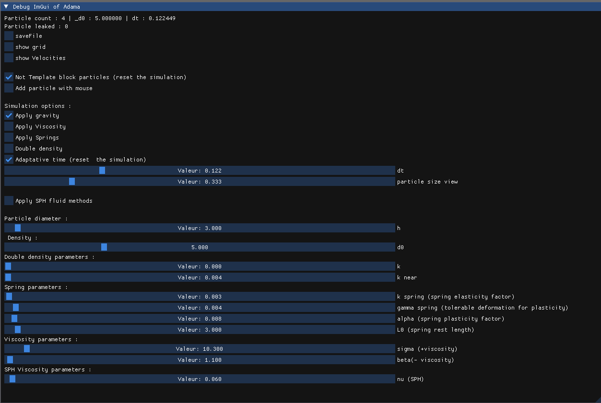
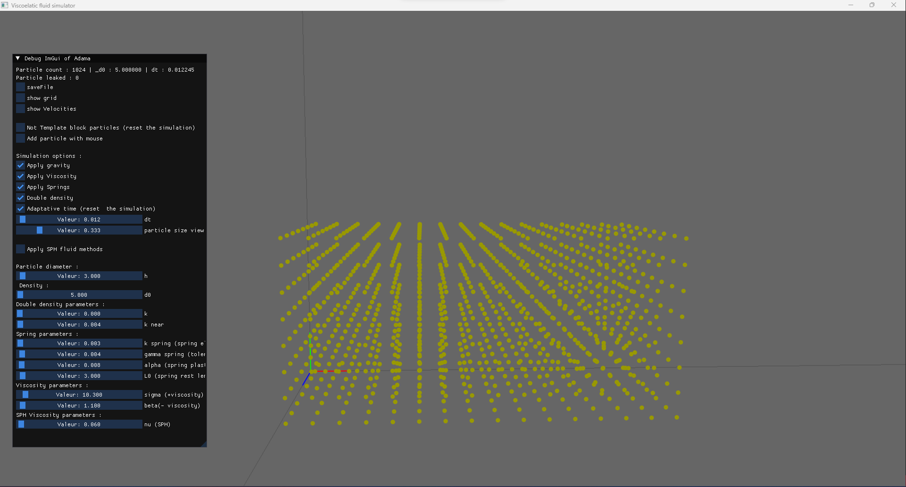
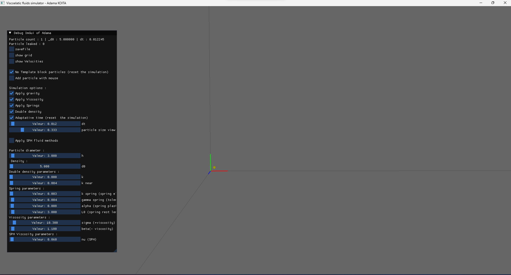
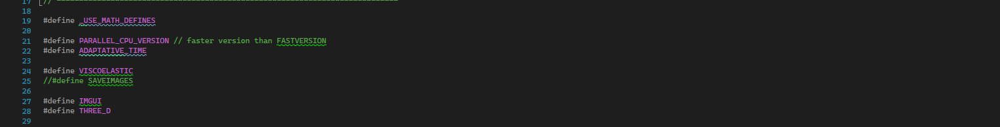

# Particle based simulation implementation - Adama KOÏTA
## Three different Example of fluid behaviour with different parameters

  
  
  
  

## Drop formation thanks to double density

  

## Comparison of viscous SPH simulation and Viscous particle based viscoelastic simulation

  
  

## ImGui  interface

- To change the view angle if you are in "Add particle with mouse" mode, click on **CTRL** and move the mouse.
- if you put too high parameters the simuation will explode and the program will stop. I advise to not touch too much to beta and to not change timestep dt. Do not increase too much k and k_near 
-If you check the simulation SPH only, make sure to have a high k.

### Not block template particles checked - only 1 particle

  

#### Not block template particles unchecked - A template of 1024 particles

  

## Code definition 

### OpenMP
 if you're computer can't manage openMP, you can directly comment the line "PARALLEL_CPU_VERSION" at the top of the main code

NB : Before the simulation run the Makefile